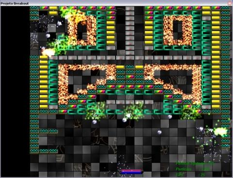
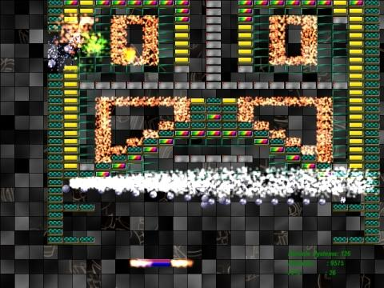

Project Breakout
===============

An unfinished breakout game made using C# and MDX (Managed DirectX)

--------

Introduction
===
In 2005 I (Hal), Wanderson Pereira (Kid Graphics) and Giusepe Casagrande (Guardian Skarabrae) started the development of a breakout game called "Project Breakout".
The game was programmed using C# and MDX (Managed Direct X).

It was never finished, but the state of development was advanced, because we had a fully functional engine and a level editor. 

Now, almost 10 years after (2014) I found it on a backup and I decided to put it on GitHub in an attempt to finish the game.

Roadmap
===
The missing parts to have a complete game are:

* HUD
	* Main menu
	* Options
	* Levels selection
	* Credits	
* High scores
* Score system

--------

How to run?
===
The game is for Windows only, so you will need an updated version of DirectX installed on your computer.

Run the  [PBGame.exe](Project Breaktout/PBGame.Exe), select a level file inside the [levels](Project Breaktout/Levels) folder.

Enjoy!

How to create a level?
===
Run the [PBeditor.exe](Project Breaktout/PBGame.Exe), you will see a screen like below:

Now you can select and put your blocks any where in the screen. To see how will it run, select "Simulate" menu.

To save your level, select the "Save" menu and save the .xml file inside de [levels](Project Breaktout/Levels)  folder.

 
--------

How to improve it?
======

- Create a fork of [Project Breakout](https://github.com/giacomelli/ProjectBreakout/fork). 
- Did you change it? [Submit a pull request](https://github.com/giacomelli/ProjectBreakout/pull/new/master).

License
======

Licensed under the The MIT License (MIT).
In others words, you can use this code for developement any kind of software: open source, commercial, proprietary and alien.

Change Log
======
 - 0.5.0 First version.
